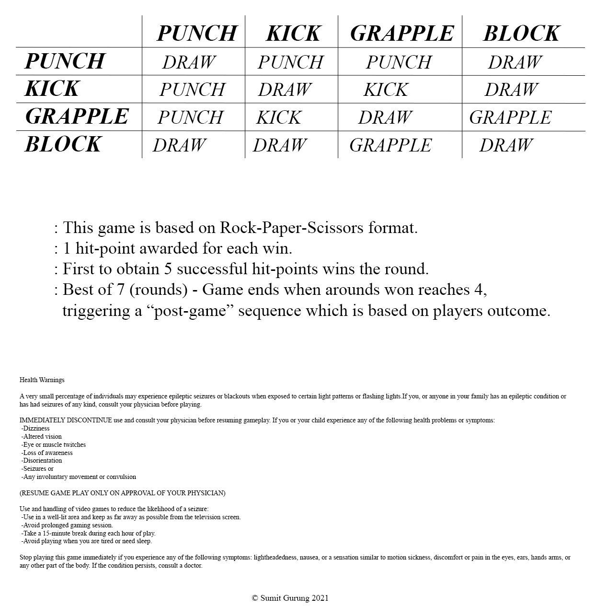

# Street Fighter II Reimagined

Street Fighter II, 90s arcade classic now re-imagined and designed based on Rock-Paper-Scissors format. 
Each turn player selects one of four possible moves of which computer response with auto-generate move 
of its own. First to score 5 hit-points wins the round. First to win 4 rounds (Best of 7) wins the game, 
triggering end-game sequence based on players outcome. 

Documentation:

Future Update ??

-Ability to select multiple characters.

-Multiple stages and themes.

-Character specific special moves.

Tech Used:

-HTML/SASS/JAVASCRIPT

-Adobe Premiere Pro, Photoshop
